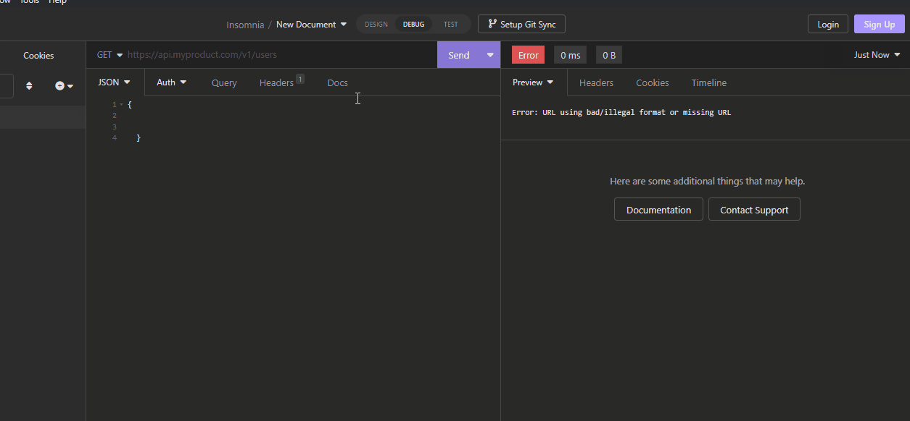

# Cocktail-App: back-end

<br/>
Aplikacja korzysta z zewnętrznego API(thecocktaildb.com), w której możemy pobrać i zapisać na swoim koncie losowo wybrany lub konketny (po wpisaniu w wyszukiwarke) drink. Każdy trunek posiada takie informacje jak: Id, nazwa, składniki, instrukcja przygotowania, info czy jest z alkoholem czy bez oraz link do zdjęcia pogladowego. Ze względu na brak czasu na skończenie front-endu zamieszczam gif z insomni z fukcjonalnością back-endu.

- front-end (w trakcie pisania):
 
 ```https://github.com/Cynio007/cocktail-app-frontend```
 


<br/>

## Uruchomienie lokalnie

Pobierz projekt

```bash
  git clone https://github.com/Cynio007/cocktail-app-backend.git
```

Przejdz do katalogu

```bash
  cd cocktail-app-backend
```

Zainstaluj niezbędne pliki

```bash
  npm install
```

Uruchom serwer

```bash
  npm start
```

<br/>

## Technologie:

- Nest
- TypeScript
- MySQL
